# PBL02 - Sistema de Monitoramento e Alarme com Máquina de Estados

## 📋 Visão Geral

Este projeto foi desenvolvido na disciplina de **PBL02** da UNIFEI e consiste em um sistema embarcado baseado no microcontrolador **LPC11Uxx** que simula um sensor inteligente com sistema de alarme configurável. O sistema utiliza uma máquina de estados para navegação entre diferentes modos de operação, interface LCD para interação com o usuário, e comunicação serial para monitoramento de valores externos.

## 🎯 Objetivos do Projeto

- Implementar uma máquina de estados robusta para controle de sistema embarcado
- Criar um sistema de alarme configurável com thresholds mínimo e máximo
- Desenvolver interface de usuário intuitiva com LCD e botões
- Implementar comunicação serial para recepção de dados de sensores
- Integrar RTC (Real Time Clock) para controle temporal
- Criar sistema multilíngue (Português/Inglês)

## 🔧 Hardware Utilizado

### Microcontrolador
- **LPC11Uxx** (ARM Cortex-M0)
- Clock: 48MHz
- Interface I2C, UART, ADC

### Periféricos
- **LCD 16x2** (interface 4-bit)
- **RTC MCP7940** (I2C)
- **5 Botões** (UP, DOWN, LEFT, RIGHT, CONFIRM)
- **4 LEDs** indicadores
- **Comunicação Serial** (UART - 9600 baud)

### Pinagem
```
LEDs:
- LED0: PIO2_9
- LED1: PIO3_0
- LED2: PIO2_0
- LED3: PIO2_6

Botões:
- UP: PIO2_8
- RIGHT: PIO2_1
- DOWN: PIO0_2
- LEFT: PIO1_8
- CONFIRM: PIO2_7

LCD:
- RS: PIO1_1
- E: PIO1_0
- D4-D7: PIO0_11, PIO2_11, PIO1_10, PIO0_9

I2C:
- SDA: PIO0_5
- SCL: PIO0_4
```

## 🏗️ Arquitetura do Sistema

### Máquina de Estados

O sistema implementa uma máquina de estados finita com 4 estados principais:

1. **STATE_TEMPO**: Configuração do horário atual
2. **STATE_IDIOMA**: Seleção do idioma (Português/Inglês)
3. **STATE_ALARME_MIN**: Configuração do threshold mínimo
4. **STATE_ALARME_MAX**: Configuração do threshold máximo



### Eventos do Sistema

```c
enum {
    EV_UP,      // Botão UP pressionado
    EV_DOWN,    // Botão DOWN pressionado
    EV_LEFT,    // Botão LEFT pressionado
    EV_RIGHT,   // Botão RIGHT pressionado
    EV_ENTER,   // Botão CONFIRM pressionado
    EV_NOEVENT  // Nenhum evento
};
```

## 📁 Estrutura do Código

### Módulos Principais

```
src/
├── main.c              # Programa principal e loop de monitoramento
├── stateMachine.c/h    # Implementação da máquina de estados
├── event.c/h           # Sistema de eventos e debounce
├── var.c/h             # Gerenciamento de variáveis globais
├── output.c/h          # Interface de saída para LCD
├── buttons.c/h         # Controle dos botões
├── lcd.c/h             # Driver do LCD
├── leds.c/h            # Controle dos LEDs
├── i2c.c/h             # Comunicação I2C
├── rtc.c/h             # Interface com RTC MCP7940
├── serial.c/h          # Comunicação serial UART
├── adc.c/h             # Conversor analógico-digital
├── io.c/h              # Abstração de I/O
└── utils.c/h           # Funções utilitárias
```

### Abstrações Implementadas

1. **Abstração de I/O**: Sistema unificado para controle de pinos
2. **Sistema de Eventos**: Processamento assíncrono de eventos de botões
3. **Gerenciamento de Estado**: Máquina de estados centralizada
4. **Interface de Usuário**: Abstração para diferentes idiomas
5. **Comunicação**: Drivers para I2C, UART e LCD

## 🔄 Funcionamento do Sistema

### Fluxo Principal

1. **Inicialização**: Sistema inicia no estado TEMPO
2. **Navegação**: Usuário navega entre estados usando botão CONFIRM
3. **Configuração**: Botões LEFT/RIGHT ajustam valores em cada estado
4. **Monitoramento**: Sistema monitora valores via serial continuamente
5. **Alarme**: Compara valores recebidos com thresholds configurados

### Sistema de Alarme

O sistema monitora valores recebidos via serial e compara com os thresholds configurados:

- **Valor < Threshold Mínimo**: Dispara alarme e acende LED0
- **Valor > Threshold Máximo**: Dispara alarme e acende LED1
- **Valor dentro do range**: Nenhum alarme

Formato da mensagem de alarme:
```
WARNING - Value [valor] is outside the range [min, max]
[timestamp]
```

### Interface de Usuário

#### Estado TEMPO
- **Display**: "Alterar tempo" / "Change time"
- **Linha 2**: HH:MM:SS
- **Controles**: LEFT/RIGHT ajustam minutos

#### Estado IDIOMA
- **Display**: "Alterar idioma" / "Change language"
- **Linha 2**: "Português" / "English"
- **Controles**: LEFT/RIGHT alternam idioma

#### Estado ALARME_MIN
- **Display**: "Limiar Minimo:" / "Min Threshold:"
- **Linha 2**: Valor numérico
- **Controles**: LEFT/RIGHT ajustam threshold mínimo

#### Estado ALARME_MAX
- **Display**: "Limiar Maximo:" / "Max Threshold:"
- **Linha 2**: Valor numérico
- **Controles**: LEFT/RIGHT ajustam threshold máximo

## 🛠️ Funcionalidades Implementadas

### ✅ Funcionalidades Básicas
- [x] Máquina de estados com 4 estados
- [x] Interface LCD 16x2
- [x] Sistema de botões com debounce
- [x] LEDs indicadores
- [x] Comunicação serial (9600 baud)
- [x] RTC com MCP7940 via I2C

### ✅ Funcionalidades Avançadas
- [x] Sistema multilíngue (PT/EN)
- [x] Monitoramento contínuo via serial
- [x] Sistema de alarme configurável
- [x] Timestamp em alarmes
- [x] Debounce de botões
- [x] Conversão BCD ↔ Decimal para RTC
- [x] Abstração de hardware

## 🎓 Aprendizados Técnicos

### Programação em C para Microcontroladores
- Manipulação direta de registradores
- Configuração de periféricos (UART, I2C, GPIO)
- Gestão de clock e timers
- Implementação de debounce por software

### Arquitetura de Software Embarcado
- **Máquina de Estados**: Implementação robusta com transições bem definidas
- **Modularização**: Separação clara de responsabilidades
- **Abstração**: Camadas de abstração para hardware
- **Gerenciamento de Memória**: Uso eficiente de memória estática

### Protocolos de Comunicação
- **I2C**: Comunicação com RTC MCP7940
- **UART**: Comunicação serial assíncrona
- **GPIO**: Controle de botões e LEDs

### Técnicas de Programação
- **Debounce**: Implementação por software com contador
- **Formatação de Strings**: Conversão numérica para display
- **Internacionalização**: Sistema multi-idioma simples
- **Conversão BCD**: Para interface com RTC

## 🚀 Como Usar

### Compilação
```bash
# Navegar para o diretório do projeto
cd PBL02

# Compilar usando o makefile
make

# Programar no microcontrolador
make flash
```

### Operação

1. **Inicialização**: Sistema inicia mostrando o horário atual
2. **Navegação**: Use o botão CONFIRM para alternar entre estados
3. **Configuração**: 
   - No estado TEMPO: LEFT/RIGHT ajustam minutos
   - No estado IDIOMA: LEFT/RIGHT alternam idioma
   - No estado ALARME_MIN: LEFT/RIGHT ajustam threshold mínimo
   - No estado ALARME_MAX: LEFT/RIGHT ajustam threshold máximo
4. **Monitoramento**: Envie valores numéricos via serial seguidos de Enter

### Exemplo de Uso Serial
```
> 75
[Sistema verifica se está entre min e max]

> 150
WARNING - Value 150 is outside the range [50, 100]
16:55:25 04/07/2025

> 25
WARNING - Value 25 is outside the range [50, 100]
16:55:30 04/07/2025
```

## 📊 Pontos Altos do Projeto

### 1. **Arquitetura Robusta**
- Máquina de estados bem estruturada
- Modularização clara e reutilizável
- Abstração eficiente de hardware

### 2. **Interface Intuitiva**
- LCD claro e informativo
- Navegação lógica entre estados
- Feedback visual com LEDs

### 3. **Funcionalidades Avançadas**
- Sistema multilíngue
- Timestamp em alarmes
- Thresholds configuráveis
- Monitoramento contínuo

### 4. **Qualidade de Código**
- Comentários descritivos
- Estrutura modular
- Tratamento de casos especiais
- Debounce implementado

### 5. **Integração de Hardware**
- Múltiplos periféricos integrados
- Comunicação I2C e UART
- Controle preciso de GPIO

## 🔮 Possíveis Melhorias

- [ ] Implementar menu de configuração avançada
- [ ] Adicionar mais sensores (temperatura, umidade)
- [ ] Implementar log de eventos na SRAM do RTC
- [ ] Adicionar comunicação Bluetooth/WiFi
- [ ] Implementar sistema de usuários
- [ ] Adicionar mais idiomas
- [ ] Implementar gráficos no LCD

## 👥 Equipe

**Grupo 06 - PBL02 - UNIFEI**

---

**Disciplina**: PBL02 - Sistemas Embarcados
**Instituição**: UNIFEI - Universidade Federal de Itajubá
**Ano**: 2025

---

*Este projeto representa a integração de conhecimentos em sistemas embarcados, programação em C, e desenvolvimento de hardware, demonstrando a aplicação prática de conceitos teóricos em um sistema funcional completo.*